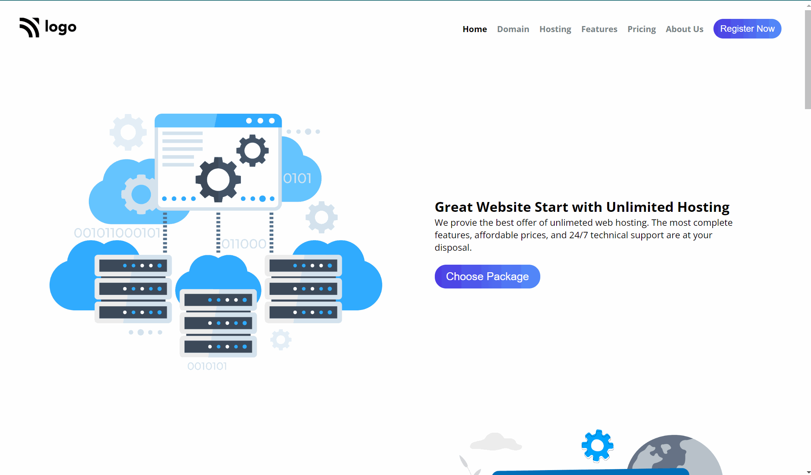

# Web Hosting Product Landing Page

> ## [Prateek Budhiraja](https://prateekbudhiraja.in)

 

## Tech Stack:

---

### Checkout the live website [here](https://webhosting-landing.vercel.app/).

---

## My Learnings

- Learned about grid template areas to position elements where ever required.

---

## How website looks like

 

